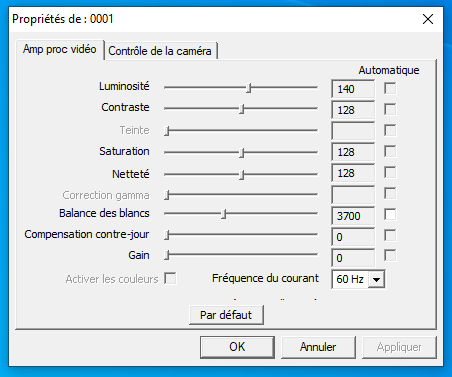
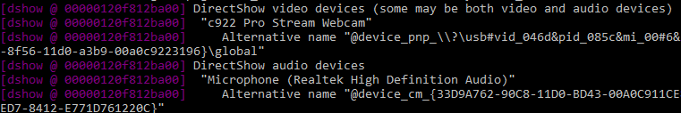

Save and Restore Webcam Settings
===============================================================================

source: https://github.com/SuslikV/cfg-cam
intro: https://blog.minsangk.im/2018/09/22/workaround-for-logitech-c922-pro-stream-webcam-not-saving-video-settings/

Run without options to load saved settings.

Run `.\WebCameraConfig.exe --savedev` to save current settings of all enabled DirectShow video input devices. It’ll save cam_sett.cfg to the current directory. 

Run with option "--help" to get brief help info.

Webcam Settings Notes
===============================================================================

C920/C922/C930e Best Practices
Exposure should be set to between -7 and -5
Low Light comp should be turned to off
Gain should be 0
White balance should be where your skintones are normal
Add a touch of sharpening from default (between 128 and 140)
Add a touch of contrast from default (between 128 and 140)
Add a touch of sat from default (between 128 and 140)
Add some brightness if the darks are a bit too dark

cliff notes: iso as low as possible, aperture as wide open as possible (with kit lens), shutter speed twice the fps, custom white balance, make sure your camera is in movie mode, and don't leave anything on auto - iso should ideally be under 800, if that's too dark you need more light(edited)
Jump

what resoultion and fps shoudl i run my webcam as  

outright the c920 + shouldnt be run under 1080p even if u  stream at 720p the reason behind this that these cameras at 1080p only realy look like a streached out 720p image 
u also have to keeep in mind that if u want yuy2 u would need ot run the camera at 540p or lower doing this if u wished to would give greator colours but if u wnat 1080p yuy2 u need bump up to a brio 
c920/c922/c930

settings recommanded

resoultion/fps type : custom 
resoultion :1920x1080
fps : 30
video formate : mjpeg
color space : 709
color range : partial
buffering : disable

video configurations

turn off auto  focuse 
turn off auto exposure
focuse : 0
exposure : -7 to -5
gain : 20
Low Light comp : untick

contrast : 128 - 140
saturation : 128 - 140
sharpness :  128 - 140
brightness : adjust this till the dark parts look normal

Webcam Settings Menu
===============================================================================

source: https://github.com/jpalbert/webcam-settings-dialog-windows

This is a small script I made to launch the webcam settings dialog directly from Windows (the same dialog as StreamLabs). In my case, the Logitech G HUB application doesn't have all the same settings as this dialog window, that's why it is useful. If you want to adjust more precisely your webcam when you use it for Zoom, Facebook or anything else, this is the script you need.

This is nowhere near perfect, I made this in 15 minutes. If you can make it better, please do! The files are heavy because of the ffmpeg executable needed for this to work.

## 1. Download

Download the files and place them in a folder somewhere on your computer.

## 2. Find out your webcam name

Make sure your webcam is connected and launch **whatismycam.bat**. A window like this will appear:

Find out what is the exact name of your webcam, for example mine is **c922 Pro Stream Webcam**, copy this somewhere.

## 3. Set your webcam name

Edit the file **webcamdialog.bat** with notepad and change the **cam** variable to your camera name (within the quotes):

    set cam="YOUR WEBCAM NAME"
    ffmpeg -f dshow -show_video_device_dialog true -i video=%cam%

In my case, I edited the file to:

    set cam="c922 Pro Stream Webcam"
    ffmpeg -f dshow -show_video_device_dialog true -i video=%cam%

## 4. Place a shortcut on your desktop (optional)

At this point, you can simply launch, by double clicking, the file **launch.bat** and the dialog window will appear. But I suggest you create a shortcut of **launch.bat** on the desktop and launch it from there.

Voila! Hope it works for you.
